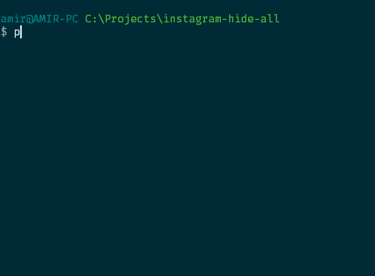

<h1 align="center">Instagram Hide All</h1>
<div align="center">
    
</div>
<h2>Temporary hide/unhide all of your Instagram followers from your stories.<h2>

## Requirements
- [Python 3](https://www.python.org/)
- [PIP](https://pip.pypa.io/en/stable)

## Installation
Install `Instagram Private API` via pip:
```bash
pip install git+https://git@github.com/ping/instagram_private_api.git@1.6.0
```
[More information](https://github.com/ping/instagram_private_api)

Download this repository.

## Usage
Before your hide/unhide your stories from your followers you should save your current information with this command.
```bash
python instagram-hide-all.py fetch
```
> This will ask your login information

### Security warning
The cache file "`data.bin`" includes your secret information. Please DO NOT Share it with anyone and when you don't need it, please delete it completely.

To hide all your followers:
```bash
python instagram-hide-all.py hide
```

To unhide all your followers:
```bash
python instagram-hide-all.py unhide
```

To reset to your preferred settings:
```bash
python instagram-hide-all.py reset
```

## Acknowledgements
- [Instagram Private API](https://github.com/ping/instagram_private_api)

## License

The MIT License (MIT). Please see [License File](LICENSE.md) for more information.
